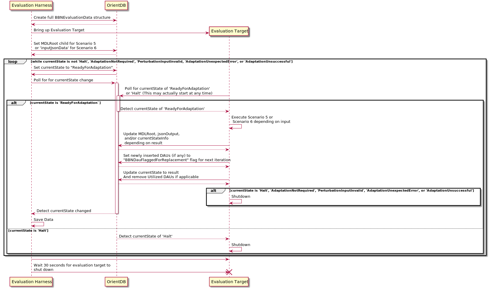

# BBN SwRI Integration Plan

The purpose of this document is to define the shared integration points for the challenge problems for Scenario 5 and Scenario 6. 

Discussions have led us to create an image that may serve one of two roles:

 * **Evaluation Target** - The virtual machine that the evaluation will take place on.
 * **Persistent Storage** - The virtual machine that must available to all executions that will be used to collect execution data for 
   post-evaluation analysis.

## Evaluation Target

* After image creation it will be offline with no internet connection
* It must have at least 4 CPU cores and 16 GB of memory. This is subject to change if bottlenecks are encountered during internal testing.
* Installation requires sudo access, so if the installation wil be unattended make sure sudo will be granted to the logged in user automatically.

### General Tips

* Make sure you are using bash as your login shell. Sometimes ssh and AWS-specific instances use lighter weight alternatives.
* Make sure your ~/.bashrc is being sourced properly. Depending on the parameters, SSH and Bash may not honor it.

### Creation

#### Steps
The following steps will prepare a system for use:

1.  Download the immortals source code.
2.  Navigate to the 'phase3' directory in the immortals root.
3.  Execute the "install.sh" script with the build flag to install dependencies and build the system (If the user requires a password for sudo):  
    `./install.sh --build`
4.  Execute the "build.sh" script to build the system:  
    `./build.sh`
5.  Shut down the system and save it to an image.

## Persistent Storage

The **Persistent Storage** system will utilize the same image as the **Evaluation Target** but will be started using different Parameters.

## OrientDB Structure

In order to facilitate challenge problem execution and validation, a formal structure must be defined. Given our input 
and output records will be well below the 10MB size where slowdown can become a problem, I propose the following structure:

### Evaluation Input/Output

A root node class by the name **BBNEvaluationData** must be created to contain input and output data.

The node must contain four properties as of this moment:

**inputJsonData** : JSON Data in a yet-to-be finalized format to be used to start Scenario 6.  
**outputJsonData** : JSON Data in a yet-to-be finalized format to be used to analyze the results of our adaptation.  
**currentState**: A value that indicates the current state of the evaluation including errors.  
**currentStateInfo**: A summary of the current state. This may be empty, and is mainly intended to provide simple error investigation when possible.  

For Scenario 5, it must contain an Containment edge that points to an **MDLRoot** object that should be considered the input configuration to the problem.

The intent is to contain complex data within the **outputJsonData** property, but to bubble up some basic summary data such as errors, general resultant state, and perhaps degree of failure for easy analysis.

### currentState

The currentState will not be updated by BBN until the perturbation has reached a terminal state. Although not set in stone, we currently expect the following possible values, and are treating it like an Enum:

| Label                         | Fatal for Scenario 5  | Fatal for Scenario 6  | Description                                                               |
|-------------------------------|-----------------------|-----------------------|---------------------------------------------------------------------------|
| ReadyForAdaptation            | false                 | false                 | Set by the Evaluator to signal to the SUT that it should begin adaptation |
| AdaptationSuccessful          | false                 | true                  | Set by the SUT to indicate a successful adaptation                        |
| AdaptationNotRequired         | true                  | true                  | Set by the SUT to indicate no adaptation is required                      |
| PerturbationInputInvalid      | true                  | true                  | Set by the SUT to indicate the input is invalid                           |
| AdaptationUnexpectedError     | true                  | true                  | Set by the SUT to indicate it encountered an unexpected error             |
| AdaptationUnsuccessful        | true                  | true                  | Set by the SUT to indicate adaptation was not successful                  |
| AdaptationPartiallySuccessful | false                 | true                  | Set by the SUT to indicate adaptation was only partially successful       |
| Halt                          | true                  | true                  | Set by the Evaluation to signal the SUT to shutdown.                      |

An example creation of this on an OrientDB Instance is as follows:

```sql
CREATE CLASS BBNEvaluationData
CREATE PROPERTY BBNEvaluationData.inputJsonData STRING
CREATE PROPERTY BBNEvaluationData.outputJsonData STRING
CREATE PROPERTY BBNEvaluationData.currentState STRING
CREATE PROPERTY BBNEvaluationData.currentStateInfo STRING
```

## Evaluation Execution 
The steps performed by the evaluator to execute evaluation will be as follows:

1.  The evaluator opens a shell on the AWS instance for the **Evaluation Target** and starts our evaluation as follows:
`bash ~/immortals_repo/phase3/start.sh --scenario <scenarioIdentifier> --odb-url <odbUrl> --odb-user <<odbUser> --odb-password <odbPassword> --odb-persistence-url <odbPersistanceUrl>`

Where the parameters are the following:

| Flag              | Value Placeholder    | Description                                                                                                    |
|:------------------|----------------------|----------------------------------------------------------------------------------------------------------------|
| --scenario        | <scenarioIdentifier> | The identifier for the scenario that is being executed. Valid values: '5' or '6'                               |
| --odb-url         | <odbUrl>             | The Url of the OrientDB instance and graph. example: 'remote:OrientDB.example.com:2424/GratefulDeadConcerts'   |
| --odb-user        | <odbUser>            | The OrientDB user name                                                                                         |
| --odb-password    | <odbPassword>        | The OrientDB user password                                                                                     |


At this point, the following occurs within the _Evaluation Target_:  

1.  The system queries the OrientDB graph for data relating to the specified scenario and saves it to **Persistent Storage**
2.  The system attempts to resolve the perturbation
3.  The results are stored in the defined location and in **Persistent Storage**
4.  The script shuts down, indicating the completion of the evaluation session.

In the event of an error, it will be output to the console and an attempt to upload it to OrientDB will be performed if possible.

## Evaluation Workflow



## Scenario 5 Details

The primary input and output artifact will be the MDLRoot object contained in the OrientDB repository. Specifics 
relating to this are documented in [bbn-swri-mdl-requirements](cp_05/bbn-swri-mdl-extensions.md)

### Scenario 5 Data Validation

In order to ensure we receive everything we need to successfully adapt and have adequate understanding of all input scenarios, a validation tool has been created to help validate input XML.

You can feed it any number of XML files and it will validate each one as a DAU Inventory if the root element has a **DAUInventory** tag or as an input configuration if the root element has a **MDLRoot** tag.

Validation is handled through a drools-based rule engine backed by the [CombinedValidationRules.xls](rules/CombinedValidationRules.xls) file.

By default the output is a color chart that indicates the values for the known fields in green or red depending on if they passed or failed. Fields that are not applicable have no coloring. If a value is not present a green or red background will indicate if that violates any expectations. Alternatively it can be run with the '--colorless-mode' flag in which only the faulty values and indicators of missing values will be visible.

Since there are no unique identifiers for DAUs, Modules, or Ports, the left side of the output contains details that will help discover where in the MDL configuration the faulty values are. The format of it is as follows:

"daus[<dau index>(<DAU Manufacturer>/<DAU Model>)].Module[<module index>(<Module Manufacturer>/<Module Model>)].Port[<port index>]

#### Validation Document

The document contains two sections: "RuleTable DAUInventory" and "RuleTable FaultyConfiguration". Each of these is used to validate the values for their respective data type.  The Headers are as follows:

"Validation Mode" - Indicates the mode in which the rules should be utilized.
"Parent Type" - This indicates the general root object which the attributes are relevant to.  It is basically a version of the MDL structure flattened for ease of constraint solving.
"Attribute Identifier" - The attribute that is being inspected.
"Required" - a boolean expression that indicates if the value is required.
"Not Allowed" a boolean expression that indicates if the value is not allowed.
"Valid Value Types" - The multiplicity of the value. It may be a "SingleValue", a "Range" (which is an object with a "Min" and a "Max"), or a Set (OrientDB List) of values.
"Valid Values" - A boolean expression that indicates the valid values. Instances where "value instanceof X" indicate the value should be of the type X. Instances where "Y contains value" are based on MDL enums and indicate the value values for the attribute.

## Scenario 6 Details

For Scenario 6 the input will be a JSON object placed in the **BBNEvaluationData**'s _inputJsonData_ node.

The contents of that object are as follows:

| Identifier        | Type      | Valid Values           | Description                                                                                                                   |
|:------------------|-----------|------------------------|-------------------------------------------------------------------------------------------------------------------------------|
| initialMdlVersion | String    | See Below              | The initial MDL version. This will be taken from a list of predefined values agreed upon prior to evaluation                  |
| updatedMdlVersion | String    | See Below              | The new MDL version. This must be later than the initial version and will be taken from the same list of predefined values    |
| updatedMdlSchema  | String    | A valid MDL XSD schema | The new MDL schema document to upgrade to. It must be less than 1 MB It should follow appropriate JSON escaping as necessary  |

The **initialMdlVersion** is mandatory. The **updatedMdlVersion** and **updatedMdlSchema** are mutually exclusive.

The valid values for **initialMdlVersion** and **updatedMdlVersion** may be any of the following:

"v0_8_7", "v0_8_8", "v0_8_9", "v0_8_10", "v0_8_11", "v0_8_12", "v0_8_13", "v0_8_14", "v0_8_16", "v0_8_17", "v0_8_19"


### Examples

#### Input Example A - Existing XSLT Transformations

```json
{
    "initialMdlVersion": "V0_8_17",
    "updatedMdlVersion": "V0_8_19"
}
```

#### Input Example B - Creating New Transformations

Ellipses are used in place of a new MDL schema for readability.

```json
{
    "initialMdlVersion": "V0_8_19",
    "updatedMdlSchema": "<...>"
}
```

## Integration Tests

Integration tests have been wrapped into a gradle project that runs an embedded OrientDB server. they can be executed 
by navigating to the [integration-tests](../../../phase3/integration-tests) directory and executing the following command:  
`./gradlew integrationTest`
