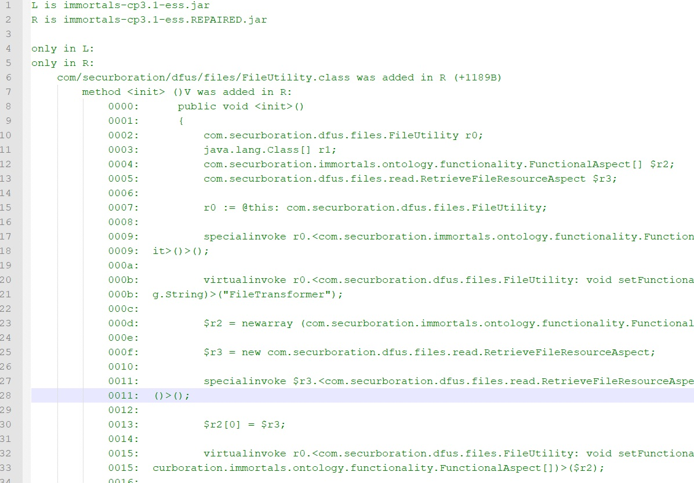
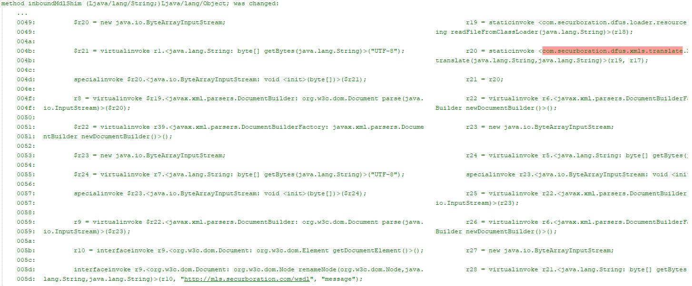
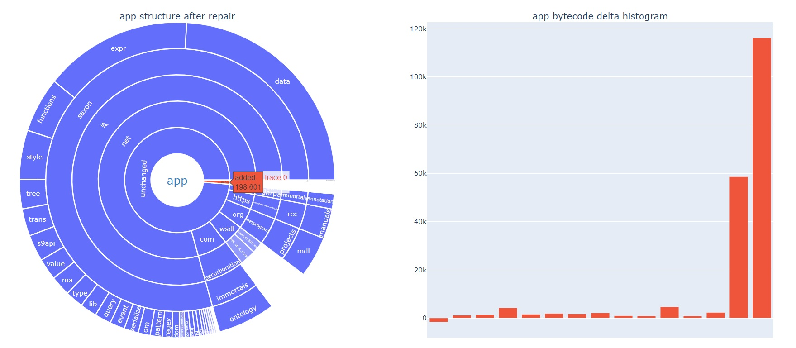
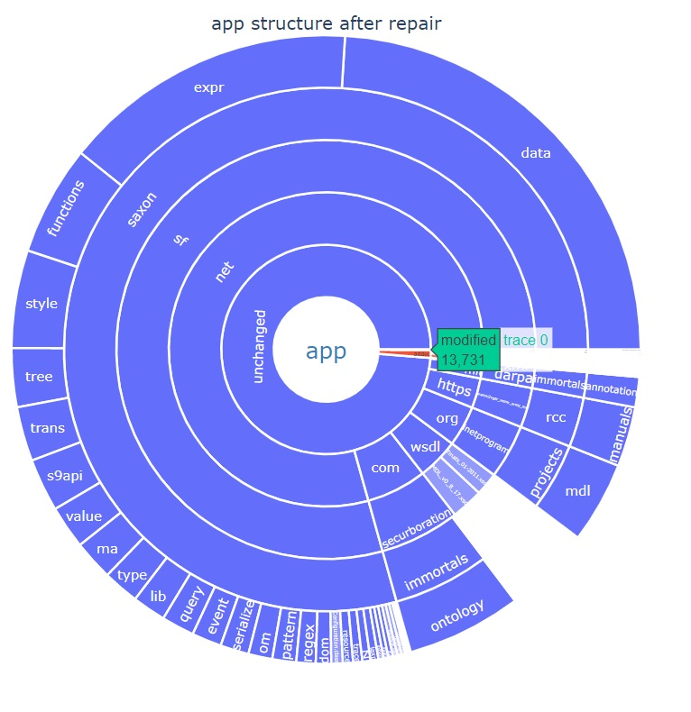
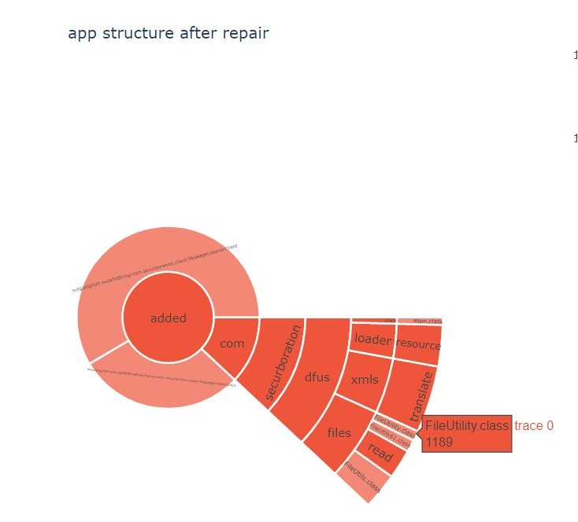
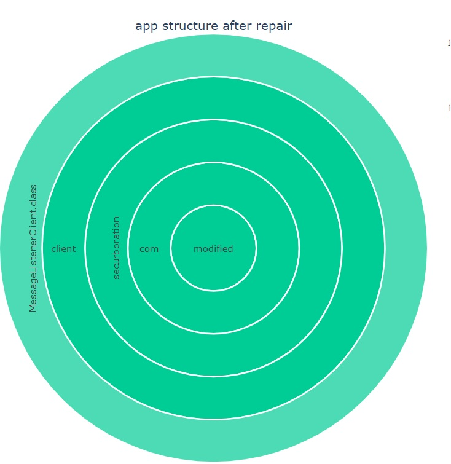
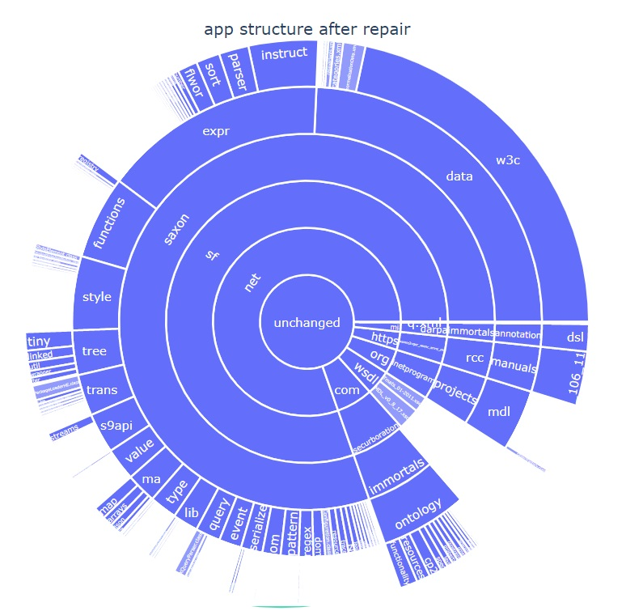
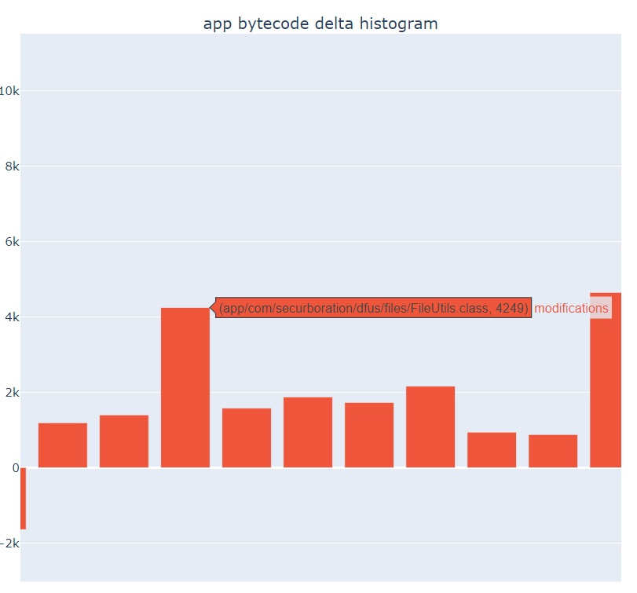

# Flight Test - Scenario 6 Results Format

## General Description

## Output Artifacts

### I) bytecode.diff

The bytecode.diff artifact is a human-readable textual diff that compares the client executable JAR before (left) and after (right) the adaptation performed as part of an evaluation run.  



Any textual content within the JAR (e.g., configuration XML, schemas, manifests) will be diffed as raw text.  Any bytecode content within the JAR (e.g., classes, methods, nested JARs) will be diffed in terms of an intermediate bytecode representation called Jimple (https://pdfs.semanticscholar.org/1a8b/a074cf7a378392d549154d8b448915fe6e99.pdf).  Any other content discovered within the JAR will be treated as binary content and diffed using a simple SHA-256 hash.

The diff decomposes changes to the JAR into three categories:
1. content only in L (section "only in L").  This section will typically be empty for the kinds of evaluations done for S6.
2. content only in R (section "only in R").  This section should contain numerous changes for an S6 evaluation run that requires adaptation.
3. content that differs between L and R (section "in both").  This section should contain numerous changes for an S6 evaluation run that requires adaptation.
4. content that is the same between L and R (note that this implicit category is not displayed in the diff)

Below is a snippet from a bytecode diff illustrating a modification to the method inboundMdlShim in existing class MessageListenerClient.class.  The adaptation process has introduced a call to an entirely new code construct not present in the original application (highlighted in orange).



### II) bytecode.diff.py

The bytecode.diff output is designed for use by operators with knowledge of bytecode and Jimple.  bytecode.diff.py is a python artifact that further distills this output to produce a more human-friendly html output.  bytecode.diff.py is a python script auto-generated at the end of a successful evaluation run that can be executed to produce a separate html artifact like the one shown below:



Note that bytecode.diff.py does not produce this HTML output during the evaluation run.  It must be executed separately via ```python bytecode.diff.py```.

There are two major figures in the generated html output.  To the left is a donut chart that shows the structure of the app after adaptation, with top-level elements "unchanged", "added", and "modified" indicating the portion of the application that was left alone, added, and modified respectively.  This figure is interactive--a user can click on slices of the donut to dive deeper into a decomposition of the application all the way down to the class granularity.



A very small number of existing classes (1 in this case) will be modified during adaptation:


A small number of new software components will be added during adaptation:


The bulk of the application will be unchanged by adaptation:


To the right of the figure is a simple histogram showing the deltas (measured as a quantity of bytes) between the original and repaired application.  Most of the changes result in a larger surface, but in one class (the one furthest to the left in the histogram), the change actually resulted in a slightly smaller artifact because a method body was replaced with a call to a synthesized proxy.

This figure is interactive in that users can zoom in arbitrarily and mouse over individual bars to see the corresponding class:


### III) outputJsonData.json

This file is a JSON document that contains details regarding the overall success and other details relating to the 
adaptation. The document fields are as follows:

#### Root jsonOutputData Description

| Label             | Description                                                                               |
|-------------------|-------------------------------------------------------------------------------------------|
| resultState       | The final state of the adaptation  (See the **AdaptationResult** below)                   |
| successPercentage | A positive decimal number from 0 to 1 that indicates the total success of the adaptation  |
| _detailedData      | Additional JSON data that is more detailed and is subject to change                       |

#### AdaptationResult Description

| Label                         | Description                                           | When you might see this                                 |
|-------------------------------|-------------------------------------------------------|---------------------------------------------------------|
| AdaptationSuccessful          | Indicates a fully successful adaptation               | Evaluation worked as expected                           |
| AdaptationNotRequired         | Indicates no adaptation was required                  | You provided an input where src equals dst              |
| PerturbationInputInvalid      | Indicates the input was invalid                       | You provided an input with an invalid src or dst schema | 
| AdaptationUnexpectedError     | Indicates an unexpected error occurred                | Something went wrong during evaluation                  |
| AdaptationUnsuccessful        | Indicates adaptation was not successful               | Adaptation had no demonstrable benefit                  |
| AdaptationPartiallySuccessful | Indicates a partially successful adaptation           | Adaptation had a small but demonstrable benefit         |

#### successPercentage Description
It is difficult to roll the various aspects of this complex scenario into a single number.  However, that is what we attempted to do with successPercentage.  It is computed as ```(1 - d' / d) * 100``` where ```d``` is the arithmetic mean portion of the XML documents with some kind of validation issue BEFORE adaptation and ```d'``` is the portion with problems AFTER adaptation.

A highly successful run will have various problems before adaptation ```(d > 0)``` and no problems after adaptation ```(d' = 0)```, giving us a score of 1.

A less successful run will have various problems before adaptation ```(d > 0)``` and some problems after adaptation ```(d' = 0 + epsilon)```, giving us a score on (0,1).

An unsuccessful run will have various problems before adaptation ```(d > 0)``` and an equal number or more problems after adaptation ```(d' = d + epsilon)```, giving us a score on (-infinity,0].

If ```successPercentage <= 0```, the evaluation run will have status ```AdaptationUnsuccessful```.
If ```0 < successPercentage <= 0.5```, the evaluation run will have status ```AdaptationPartiallySuccessful```.
If ```0.5 < successPercentage <= 1```, the evaluation run will have status ```AdaptationSuccessful```.

#### _detailedData Description

_detailedData contains fine-grained metrics gathered during the evaluation run.  These are broken down into categories.  Some of the more interesting categories are described below:

  1. ```"categoryDesc" : "impacts of adaptation"```: describes how well the client/server worked together before and after adaptation.
  2. ```"categoryDesc" : "fidelity of client->server translation"```: describes the changes detected during the src -> dst schema mapping.
  3. ```"categoryDesc" : "fidelity of server->client translation"```: describes the changes detected during the dst -> src schema mapping.  
  4. ```"categoryDesc" : "metrics relevant to evaluation workflow"```: describes metrics gathered during evaluation (start/end times, cores available, ram available, etc.).    
  5. ```"categoryDesc" : "analysis metrics"```: describes metrics gathered during analysis.  These are mostly triple-oriented since RDF is the knowledge representation format.  
  

### IV) evaluationArchive.zip
evaluationArchive.zip is a zip archive of the evaluation working directory.  Note that it may be quite large (tens of MB).  This includes all of the output streams from the various processes involved in evaluation.  It also includes all binaries for the originally compiled and adapted application.  Several of the most important directories in this archive are enumerated below:

* evaluation inputs:
  * ```evaluationArchive.zip\ess\ess\schema\client\```: contains the provided client (src) schema
  * ```evaluationArchive.zip\ess\ess\schema\server\```: contains the provided server (dst) schema
  * ```evaluationArchive.zip\ess\ess\datasource\```: contains the provided bag of src-compliant XML documents
* stdout streams from the various processes involved in evaluation:
  * ```evaluationArchive.zip\ess\command-01-of-29 (start fuseki)```: this contains the stdout and stderr streams from the fuseki process used during evaluation and a list of the args provided to the executable.
  * ```evaluationArchive.zip\ess\command-XX-of-YY (DESC)```: this contains the stdout and stderr streams from the DESC process (there are 29 of these for a successful evaluation run).
* executables:
  * ```evaluationArchive.zip\ess\ess\server\target\immortals-cp3.1-server-v1-1.0.0.jar```: The compiled server  
  * ```evaluationArchive.zip\ess\ess\client\target\immortals-cp3.1-client-1.0.0.jar```: The originally compiled client before adaptation
  * ```evaluationArchive.zip\ess\ess\client\target\immortals-cp3.1-client-1.0.0-INST.jar```: The client after dynamic analysis instrumentation
  * ```evaluationArchive.zip\ess\ess\client\target\immortals-cp3.1-client-1.0.0MODIFIED.jar```: The resultant client after adaptation  
* XSLT artifacts:
  * ```evaluationArchive.zip\ess\ess\xsdts-client\0\response.xslt```: the synthesized client->server XSLT
  * ```evaluationArchive.zip\ess\ess\xsdts-client\1\response.xslt```: the synthesized server->client XSLT  
* captured XML artifacts:
  * ```evaluationArchive.zip\ess\ess\messages\[some timestamp]\```: the XML documents sent during ```baseline testing``` by the client to the server and returned by the server, captured at the client boundary.  This will include a small number of pings followed by a larger number of MDL transfers within a SOAP payload.
  * ```evaluationArchive.zip\ess\ess\messages\[some timestamp]\```: the XML documents sent during ```dynamic analysis``` by the client to the server and returned by the server, captured at the client boundary.  This will include a small number of pings followed by a larger number of MDL transfers within a SOAP payload.
  * ```evaluationArchive.zip\ess\ess\messages\[some timestamp]\```: the XML documents sent during ```evaluation testing``` by the client to the server and returned by the server, captured at the client boundary.  This will include a small number of pings followed by a larger number of MDL transfers within a SOAP payload.

  


