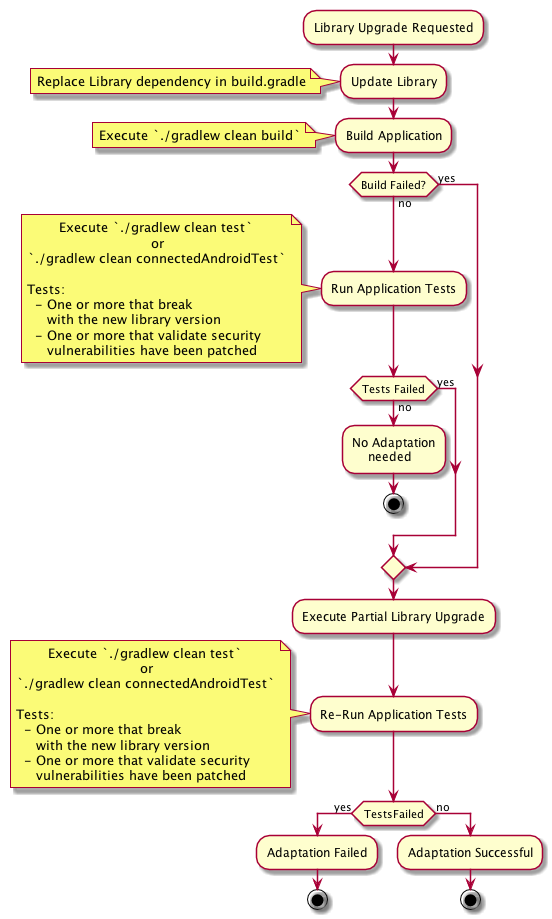

# Third Party Partial Library Update Evaluation Plan

## Execution Lifecycle


## Validation

There must at minimum be two tests for each scenario:

Test A: An upgrade-blocking test that prevents a direct library upgrade. It must:  
  - Pass with the original library version
  - Fail with the newer library version
  - Pass with the partial upgraded library version


Test B; A test that validates the security vulnerability has been resolved. It must:
  - Fail with the original library version
  - Pass with the newer library version
  - Pass with the partial upgraded library version

As indicated during the  meeting, Test B may not be feasible for many of the scenarios you are doing, so some sort of 
other validation such as a diff and description will be suitable.


## DAS Workflow




## Dropbox Example

### Validation

The Dropbox example has had validation of the successful patch implemented in the following file:

`applications/examples/ThirdPartyLibAnalysisAndroidApp/app/src/androidTest/java/mil/darpa/immortals/examples/tests/DropboxInstrumentedTest.java`

The method `shouldPassWith003ButFailWith006` still needs to be filled in with a scenario that

In order to modify the network state from within the example a rooted emulator instance had to be used, a script is 
located in `shared/utils/` to set up a rooted emulator instance to use. From that directory it can be run as follows:  
`bash superuser_emulator_start.sh MyEmulatorName`  

It can also be used to launch the shut down emulator. Please note starting this emulator from an IDE will not work 
as the script needs to set some values and set the system partition to writeable. 

The test is based on the example found at `https://github.com/dropbox/dropbox-sdk-java/issues/78` with some code also taken from the sample application.

The test goes through the following steps. See code for matching comments:

1. Validate a small normal upload works.  
2. Start upload #1 from the bug report.  
3. Wait two seconds for upload #1 to connect and start  
4. Disconnect network  
5. Wait for a timeout of 180 seconds or for both downloads to fail  
6. Check that both downloads failed  
7. Assert that no other errors were detected that could have impacted the results.  

Some additional steps are included beyond the example to ensure that we do not get false positives on the test.

### Partial Library Upgrade Input

We provide the following file as input:

```json
{
    "currentlyUsedLibrary": {
        "jarFilepath": "/IMMORTALS_ROOT/applications/examples/ThirdPartyLibAnalysisAndroidApp/app/libs/dropbox-core-sdk-3.0.3.jar"
    },
    "targetUpgradeLibrary": {
        "jarFilepath": "/IMMORTALS_ROOT/applications/examples/ThirdPartyLibAnalysisAndroidApp/app/upgrade-targets/dropbox-core-sdk-3.0.6.jar"
    },
    "targetApplications": [
        {
            "jarFilepath": "/absolute/path/to/application/using/currently/used/library.jar"
        }
    ]
}

```

## Adding Evaluation Scenarios

### Adding An Android Library Upgrade Scenario
1. Add the currently used library jar to `applications/examples/ThirdPartyLibAnalysisAndroidApp/app/libs`
2. Add the newer jar to `applications/examples/ThirdPartyLibAnalysisAndroidApp/app/upgrade-targets`
3. In the directory 
    `applications/examples/ThirdPartyLibAnalysisAndroidApp/app/src/androidTest/java/mil/darpa/immortals/examples/tests`,
    copy `DummyTest.java` to a new class for the partial library upgrade.
4. Within the class, rename the class name to match the new file.
5. Replace the contents of the two tests with tests that perform the purpose indicated by the comments for the partial 
   library upgrade scenario.


### Adding A Java Library Upgrade Scenario
1. Add the currently used library jar to `applications/examples/ThirdPartyLibAnalysisJavaApp/app/libs`
2. Add the newer jar to `applications/examples/ThirdPartyLibAnalysisJavaApp/app/upgrade-targets`
3. In the directory 
    `applications/examples/ThirdPartyLibAnalysisJavaApp/app/src/test/java/mil/darpa/immortals/examples/tests/`,
    copy `DummyTest.java` to a new class for the partial library upgrade.
4. Within the class, rename the class name to match the new file.
5. Replace the contents of the two tests with tests that perform the purpose indicated by the comments for the partial 
   library upgrade scenario.

## Executing Examples

If it is an Android example, execute the following command from the directory `applications/examples/ThirdPartyLibAnalysisAndroidApp`:

`./gradlew clean connectedAndroidTest`

If it is a Java example, execute the following command form the directory `applications/examples/ThirdPartyLibAnalysisJavaApp`:

`./gradlew clean test`


