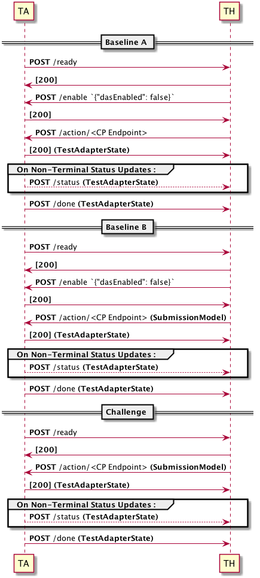

# Unified Test Harness API

## Description
To orchestrate a cohesive adaptation scenario throughout IMMoRTALS, we have decided to continue forward in phase 2 with
a unified API similar to what we did for phase 1. Many of the concepts are the same, but with additional flexibility
in terms of how requirements and resources are described.

See the Data Dictionary section of this document for details regarding the **bolded** object identifiers.

## Workflow

The overall workflow for all challenge problems is as follows:


The overall sequence that these are derived from is as follows:

1. The TA POSTs an empty body to TH /ready.
2. If the baseline application should be used, the TH POSTs '{"dasEnabled": false}' to the TA to disable the DAS.
3. If the baseline environment should be used, the TH POSTs an empty body the challenge problem endpoint.  For a perturbed environment, a **SubmissionModel** is POSTed.
4. The TA responds with a **TestAdapterState** object indicating the state.
5. The TA POSTs a **TestAdapterState** object to the TH /status endpoint whenever a change in state occurs.
6. The TA POSTs a **TestAdapterState** object to the TH /done endpoint when execution is finished.

At any time during these workflows the _error_, _alive_, or _query_ endpoints may be called.  Do not disable or enable the DAS during a test or unexpected behavior may occur.


## Test Harness Endpoints

Headers are not necessary unless specified.

### POST to /ready
__Endpoint Request Payload__: None

__Expected Response__: A 200 response code with no body. This response will likely be unhandled.

### POST to /error
__Endpoint Request Payload__: A string or indeterminate JSON object containing data to debug the error.

__Endpoint Request Headers__: 'Content-Type: text/plain'

__Expected Response__: A 200 response code with no body. This response will likely be unhandled with an expectation of an imminent TA shutdown.

### POST to /status
__Endpoint Request Payload__: A **TestAdapterState** object reflecting the current unfinished state.

__Endpoint Request Headers__: 'Content-Type: application/json'

__Expected Response__: A 200 response code with no body. This response will likely be unhandled.

### POST to /done
__Endpoint Request Payload__: A **TestAdapterState** object containing the terminal state of the adaptation and validation.

__Endpoint Request Headers__: 'Content-Type: application/json'

__Expected Response__: A 200 response code with no body. This response will likely be unhandled.


## Test Adapter Endpoints

Headers are not necessary unless specified.

### GET to /alive
__Endpoint Request Payload__: None

__Expected Response__: A 200 response code

### POST to action/\<challenge problem endpoint\>
__Endpoint Request Payload__: A **SubmissionModel** JSON object as described in the challenge problem documentation.

__Endpoint Request Headers__: 'Content-Type: application/json'

__Endpoint Response__: A **TestAdapterState** JSON object describing the initial state of the submission.

### GET to /query
__Endpoint Request Payload__: None

__Endpoint Response__: A **TestAdapterState** object reflecting the current or last perturbation submission, or nothing if no perturbations have been submitted yet.

### POST to /enable
__Endpoint Request Payload__: A Json object of either '{"dasEnabled": true}' or '{"dasEnabled": false}' depending on if
the DAS should be enabled. It will be enabled by default. disabling the DAS will allow running the Baseline scenarios
without any DAS augmentation.

__Endpoint Request Headers__: 'Content-Type: application/json'

__Expected Response__: A 200 response code

## Perturbation Submission
The submission endpoints and data used are covered in the documentation for each challenge problem.  However, it should
be noted that they are subsections of a separate internal unified interface that defines the overall baseline
environment (including details from phase 1).  As each challenge problem provides perturbation of all properties that
might result in an augmentation, any attempt to submit a perturbation option outside of the scope of the specific
challenge problem documentation will be treated as an invalid submission.

An empty body submitted to any of the endpoints shall be considered a baseline environment and application and will
execute validation without any augmentation.

## Test Adapter State
The **TestAdapterState* return object is largely unchanged since phase 1. The most significant changes are as follows:
1. The test state has replaced the non-intermediary states with the **TestOutcome** values defined in the evaluation
methodology document.
2. The primary indicator of success or failure is now a _verdictOutcome_ field in the **ValidationState** that consists of
intermediary states along with the **Verdict** values defined in the evaluation methodology.
3. Each **TestDetail** object has an _intent_ element in it to pair the test with the intent it validates.

The **AdaptationState** and **ValidationState** also each contain a _details_ field.  The intent of this is to provide
a summary of what is happening in the DAS and SUT. As that is an ongoing task, those values are stubbed out as General
JSON Objects for now.

#### Sample TestAdapterState value
```  
{
    "adaptation": {
        "adaptationStatus": "SUCCESS",
        "details": {}
    },
    "identifier": "PerturbationValidationInstanceIdentifier",
    "validation": {
        "executedTests": [
            {
                "actualStatus": "COMPLETE_PASS",
                "desiredStatus": "COMPLETE_PASS",
                "details": {},
                "intent": "SendLocation",
                "testIdentifier": "LocationSendTest"
            },
            {
                "actualStatus": "COMPLETE_PASS",
                "desiredStatus": "COMPLETE_PASS",
                "details": {},
                "intent": "SendImage",
                "testIdentifier": "ImageSendTest"
            }
        ],
        "verdictOutcome": "PASS"
    }
}  
```  

### Data Dictionary

#### TestAdapterState  
__Type__: JSON Object  
__Description__: The overall status of the Test Adapter used for all done, status, and perturbation responses  

| Field      | Type                  | Description                                                                      |  
| ---------- | --------------------- | -------------------------------------------------------------------------------- |  
| adaptation | AdaptationStateObject | The state of the DAS adaptation                                                  |  
| identifier | str                   | The internal identifier used to bind this perturbation to any artifacts produced |  
| timestamp  | int                   | Last Updated time (equivalent to Java 'System.currentTimeMillis()')              |  
| validation | ValidationStateObject | The state of the validation                                                      |  

#### AdaptationStateObject  
__Type__: JSON Object  
__Description__: The state of the DAS adaptation  

| Field            | Type                | Description                                     |  
| ---------------- | ------------------- | ----------------------------------------------- |  
| adaptationStatus | DasOutcome          | Indicates the current state of the DAS          |  
| details          | Generic JSON Object | A POJO object detailing the behavior of the DAS |  

#### DasOutcome  
__Type__: String Constant  
__Description__: The current state of the DAS  

| Values         | Description                                                  |  
| -------------- | ------------------------------------------------------------ |  
| PENDING        | DAS execution is pending (non-terminal)                      |  
| RUNNING        | DAS is executing analysis and adaptation (non-terminal)      |  
| NOT_APPLICABLE | Baseline Submission - No DAS needed                          |  
| NOT_POSSIBLE   | An invalid perturbation has been submitted                   |  
| SUCCESS        | Adaptation Successful                                        |  
| FAIL           | Adaptation attempted but failed adaptation module validation |  
| ERROR          | An unexpected error has occured                              |  

#### ValidationStateObject  
__Type__: JSON Object  
__Description__: The current state of intent satisfaction validation  

| Field          | Type                  | Description                                       |  
| -------------- | --------------------- | ------------------------------------------------- |  
| executedTests  | List[TestStateObject] | The tests executed to support the verdict outcome |  
| verdictOutcome | VerdictOutcome        | The outcome of the intent preservation            |  

#### TestStateObject  
__Type__: JSON Object  
__Description__: The current state of an intent test validation  

| Field          | Type                | Description                                                             |  
| -------------- | ------------------- | ----------------------------------------------------------------------- |  
| actualStatus   | TestOutcome         | The current state for the test                                          |  
| desiredStatus  | TestOutcome         | The desired outcome for the test. Will always be 'COMPLETE' for Phase 2 |  
| details        | Generic JSON Object | Details relating to the resultant test state.                           |  
| intent         | str                 | The intent the test validates                                           |  
| testIdentifier | str                 | An identifier for the test                                              |  

#### TestOutcome  
__Type__: String Constant  
__Description__: The outcome of a test  

| Values            | Description                                              |  
| ----------------- | -------------------------------------------------------- |  
| PENDING           | Indicates the specified action is pending (non-terminal) |  
| RUNNING           | Indicates the specified action is running (non-terminal  |  
| NOT_APPLICABLE    | Indicates the specified action is not applicable         |  
| COMPLETE_PASS     | Indicates the test completed with a 'PASS'               |  
| COMPLETE_DEGRADED | Indicates the test completed with a 'DEGRADED'           |  
| COMPLETE_FAIL     | Indicates the test completed with a 'FAIL'               |  
| INVALID           | See LL Evaluation Methodology                            |  
| INCOMPLETE        | See LL Evaluation Methodology                            |  
| ERROR             | See LL Evaluation Methodology                            |  

#### VerdictOutcome  
__Type__: String Constant  
__Description__: See LL Evaluation Methodology  

| Values       | Description                    |  
| ------------ | ------------------------------ |  
| PENDING      | The verdict outcome is pending |  
| RUNNING      | The validation is running      |  
| PASS         | See LL Evaluation Methodology  |  
| DEGRADED     | See LL Evaluation Methodology  |  
| FAIL         | See LL Evaluation Methodology  |  
| INCONCLUSIVE | See LL Evaluation Methodology  |  
| INAPPLICABLE | See LL Evaluation Methodology  |  
| ERROR        | See LL Evaluation Methodology  |  
