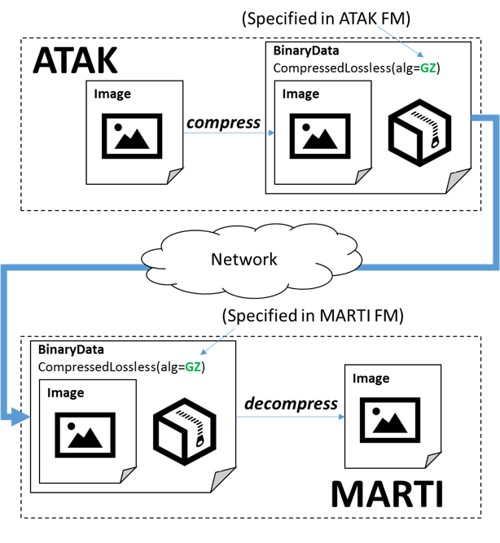

# IMMoRTALS Challenge Problem 2 - Cross-Application Dependencies

## Introduction

Modern software systems seldom operate in isolation. For example,
Service-Oriented Architectures (SOAs) distribute distinct system
functionality across discrete (and typically remote) processes that
communicate using a network. Designers of these systems often bake
assumptions about the availability and mechanics of interacting with
other architecture components into their application logic, making these
systems fragile over time.

A specialized class of software, called *middleware* is often used to
bridge different parts of an application. In general, middleware handles
data format differences between the interacting parts, and offers
specific idioms (protocols) for using it. Even when a middleware is
used, dependencies across interacting components cannot be eliminated.
Changing the interaction pattern or properties on one side is likely to
require changes on the other side of the interacting parties. Upgrading
middleware versions or changing from one middleware to another will also
require changes on both sides. The goal of this CP is to begin exploring
how to adapt software in response to changes in the middleware space.

For example, consider the client-server interaction in the IMMoTRALS
tactical SA application. The ATAK Lite clients use a socket-based
middleware that uses COT messages to periodically transmit SA location
information (and other SA data) to the MARTI server. Now suppose a new
requirement is asserted specifying that all messages traversing networks
must be encrypted. It is not enough to simply add encryption logic on
the client side. The server must also be adapted to properly decrypt the
information before using it. Additionally, the client and server
implementers must agree upon and utilize a secure key exchange
procedure.

## Challenge Problem Description

Challenge Problem 2 (CP2) will investigate the change drivers in the
middleware space. In the context of the IMMoRTALS platform application,
this CP will address changes in how SA data is shared between the ATAK
Lite clients and the MARTI server, including properties of data, send
and receive mechanisms, adding new data types etc. One common aspect of
the resulting adaptations is that they require simultaneous/correlated
modification of ATAK Lite and MARTI. As in Phase 1, most of these
changes come from mission requirements, and the resulting adaptations
will lead to new application binaries.

We will now describe some examples that we are considering initially in
more detail. These focus on properties of SA Data being exchanged
between the ATAK client and MARTI:

1.  Data compression

    a.  **Historical justification for adaptation**: There is a rich
        history of the emergence of new lossless compression algorithms
        over time. For example, gzip was released in 1993, bzip2 was
        released in 1996, and LZMA was released in 1998, and LZMA2 was
        released in 2009. Long-lived software should be able to benefit
        from compression algorithms that have not yet been created.

    b.  **Technical challenges**:

        i.  There exist time/space tradeoffs between various algorithms
            and configurations. For example, using a larger dictionary
            often (but not always) achieves better compression ratios at
            the cost of more CPU time.

        ii. Certain types of data are more amenable to compression than
            others. For example, a list of random numbers will compress
            poorly whereas a human-readable text document will compress
            nicely.

        iii. Lossless compression is an invertible transformation. If we
            compress data in ComponentX and transmit that data to
            ComponentY, ComponentY must subsequently decompress it
            before it can be used.

2.  Data encryption

    a.  **Historical justification for adaptation**: There is a rich
        history of the emergence of new cryptographic standards and best
        practices over time. For example, DES became a FIPS standard in
        1975 but was easily brute forced by the late 1990s; DES3 became
        a standard in 1999 but was subsequently superseded by AES
        in 2001. Similarly, the recommended RSA key strength has
        increased from 512 bits at inception to 2048 bits as of 2016
        (with a target key durability of 2030).

    b.  **Technical challenges**:

        i.  Encryption is another invertible transformation. If we
            encrypt data in ComponentX and transmit that data to
            ComponentY, ComponentY must subsequently decrypt it before
            it can be used. Additionally, the cipher configurations for
            both components must be compatible.

        ii. Introducing cryptographic techniques into an application may
            require synthesizing multiple new dataflows. For example,
            symmetric encryption necessitates the use of key management
            procedures.

A simplification of our CP2 system architecture is provided in Figure 1
below. In this simplified architecture, ATAK interacts with MARTI by
transmitting Cursor-on-Target (CoT) messages across network. MARTI then
responds to ATAK with an ACK message (indicating success) or NACK
(indicating the encounter of an unspecified failure condition while
processing the client’s request). Under correct operation, ATAK should
never receive a NACK from the server.


Figure : CP2 client server architecture

## Adaptation scenarios

The following scenarios can occur at various points in the lifetime of
the MARTI/ATAK system. For each we describe the adaptation stimuli and
verification procedures:

1.  MARTI/ATAK are initially coded using a simple event driven
    protocol.. However, at some point in the future, a new requirement
    is put in place such that MARTI/ATAK must now encrypt their
    communications at the application layer. IMMoRTALS detects the
    constraint violation regarding unencrypted network traffic, and adds
    application-layer data encryption wherever messages are transmitted
    across the network. IMMoRTALS must also add decryption code wherever
    messages are received from the network.

<!-- -->

a.  Validation is achieved by monitoring the messages transmitted from
    ATAK to MARTI.

<!-- -->

i.  After adaptation, the message should contain an unencrypted frame
    and an encrypted payload.

ii. A monitor aware of the symmetric key and cipher configuration used
    by the client and server should be able to inspect the messages and
    verify the integrity of their content.

iii. After adaptation, no NACK messages should be observed.

<!-- -->

a.  Validation can also be achieved by inspecting the synthesized code

<!-- -->

i.  After adaptation, new encryption code regions should be injected
    into ATAK and MARTI.

<!-- -->

1.  The mission intends to deploy in a bandwidth restricted environment,
    and dictates that ATAK Clients should send compressed data to reduce
    network consumption. IMMoRTALS analyzes the system and determines
    that there is a dataflow relationship between that now-compressed
    data and a corresponding code unit in MARTI. It then selects the
    appropriate lossless compression code block and injects it the ATAK
    Lite code and injects similarly configured decompressor block in the
    appropriate place in MARTI.

<!-- -->

a.  Validation is again achieved by monitoring the messages transmitted
    from ATAK to MARTI.

<!-- -->

i.  After adaptation, the messages should be compressed.

ii. After adaptation, the messages should be much smaller than before.

iii. After adaptation, no NACK messages should be observed.

<!-- -->

a.  Validation can also be achieved by inspecting the synthesized code

<!-- -->

i.  After adaptation, new compression code regions should be injected in
    both MARTI and ATAK.

<!-- -->

1.  At some point in the future a new compression algorithm is
    discovered with much better time/space behavior than an algorithm
    currently used by MARTI/ATAK. We will call the old algorithm
    BogoCompress and the new algorithm LZMA-3. Mission commanders
    warrant that their applications must take advantage of the
    improvement. IMMoRTALS detects the use of BogoCompress in MARTI and
    ATAK, then replaces the appropriate client/server code regions with
    LZMA-3 code.

    a.  Validation is achieved by monitoring the messages transmitted
        from ATAK to MARTI.

        i.  After adaptation, the messages should be compressed using
            the new algorithm.

        ii. After adaptation, the messages should be much smaller than
            before.

        iii. After adaptation, no NACK messages should be observed.

    b.  Validation can also be achieved by inspecting the synthesized
        code

        i.  After adaptation, the BogoCompress code regions should be
            replaced with LZMA-3 code in both MARTI and ATAK.

2.  At some point in the future, AES-128 is determined to be
    insufficiently secure due to the release of new brute forcing
    hardware. Instead, AES with 256-bit keys is recommended. Mission
    commanders require that AES-128 now should be deprecated and
    recommend use of AES-256.

<!-- -->

a.  Validation is achieved by monitoring the messages transmitted from
    ATAK to MARTI.

<!-- -->

i.  After adaptation, the data should be encrypted using a 256-bit key.
    This is difficult to verify generally, but could be validated under
    the assumption that ATAK transmits a single message repeatedly to
    MARTI and that the key is known to the monitor.

ii. After adaptation, no NACK messages should be observed. See the point
    above about encryption of messages.

<!-- -->

a.  Validation can also be achieved by inspecting the synthesized code

<!-- -->

i.  After adaptation, the encryption code regions in ATAK and MARTI
    should be configured using a 256-bit key.

## Analysis supporting CP2 adaptation
==================================


Figure : CP2 architecture

During the dataflow analysis of the ATAK/MARTI system, we will detect
that messages are transmitted across the network from ATAK to MARTI. To
capture details about this interaction, our dataflow analysis emits an
abstraction called an *analysis frame*, a recursive structure which
carries an abstract datatype and properties assumed to hold for the
message. These analysis frames are depicted at a high level above in
Figure 2 and a more detailed example is provided below in Figure 3.

We have thus far modeled DFUs as having property-modifying side effects
on the dataflows with which their functional aspects intersect. For
example, the *compress* aspect of a *compressor* DFU adds the
*compressed* property to a dataflow analysis frame whereas the *deflate*
aspect of that DFU removes that property. The analysis frames in Figure
3 are consistent in that the *compress* aspect of the *compressor* DFU
in ATAK emits a data frame with the same properties expected by the
*decompress* aspect in MARTI.



Figure : Dataflow analysis for a simple ATAK/MARTI architecture

The consistency between expected and actual properties shown in Figure 3
is serendipitous—it is by no means guaranteed. IMMoRTALS must be able to
detect and repair inconsistencies detected through this analysis. For
example, if MARTI is modified to use bzip2 compression instead of gzip,
there is an inconsistency between the client and server and ATAK must
also be modified. This scenario is shown below in Figure 4. We
anticipate that inconsistency is a common occurrence and a useful change
driver.


Figure : Illustration of a scenario with
inconsistent analysis frames

A more complex example in which ATAK captures an image, compresses it
using the gzip algorithm, then transmits it to MARTI (which then does
the inverse) is shown below in Figure 5.


Figure : Complete analysis of hypothetical
scenario involving correct transmission of a compressed, encrypted
message containing an image from ATAK to MARTI

## CP2 Test Parameters

### Formalisms

-   We will define a specification format for several popular symmetric
    key encryption algorithms (DES, 3DES, AES, Blowfish). This format
    will account for the following:

    -   *KeyLength* is an algorithm-dependent enumeration of valid key
        lengths

    -   *InitializationVector* is an algorithm-dependent number of bytes
        to use as an initialization vector

    -   *PaddingScheme* is an enumeration of several common padding
        schemes. E.g., PKCS7, ANSI X.923, ISO 10126.

    -   *CipherMode* is an enumeration of several common chaining modes.
        E.g., ECB, CBC, PCBC.

-   We will define a specification for several lossless compression
    algorithms (gzip, bzip2, lzma). Similar to encryption, we will
    enumerate various configuration options that must be consistent
    between the compressor and decompressor.

-   We will create feature vocabulary powerful enough to describe ATAK
    and MARTI with variation points into which features for performing
    encryption and compression of the data transmitted across the wire
    can be injected. These variation points will also accept a
    configuration specification.

-   We will provide a vocabulary for expressing constraints on
    algorithms/configurations. E.g., a SME may want to mandate increased
    key length for symmetric ciphers to account for the development of
    more powerful ASICs for key brute forcing. This vocabulary will
    contain links to components in the feature model.

### Instantiations of formalisms

-   We will provide feature models for ATAK and MARTI

    -   The ATAK feature model will include variation points for
        injecting an optional BinaryTransformer DFU just before the data
        is transmitted across network. Compressor and Encryptor are
        subtypes of the BinaryTransformer functionality.

    -   The MARTI feature model will also include a variation point for
        injecting a BinaryTransformer DFU.

-   We will provide at least two example configurations for symmetric
    key encryption. One of these will be weak by modern standards (DES)
    and another will be strong (AES-256).

-   We will provide at least two example configurations for compression.
    One of these will use a dated algorithm (gzip) and another will use
    the more modern one (lzma).

-   We will provide an assertion mandating the use of application-level
    encryption. This assertion can be bound to feature models for
    ATAK/MARTI

### Software

-   We will provide ATAK and MARTI code, build scripts, and a virtual
    testing environment

-   We will provide the ATAK and MARTI unit and integration test suites
    required for dynamic analysis of the system

-   We will provide an ATAK driver that periodically transmits messages
    to MARTI and verifies the correct ACK responses. The driver treat as
    a failure any NACK response returned by MARTI.

## Intent Specification and Evaluation Metrics

### Intent specification

Intent within IMMoRTALS takes the form of assertions that bind to the
feature model. We will provide an easy-to-use knob-based convenience
mechanic for manipulating these assertions. The resultant assertions
emitted after modifying a knob will be visible in the triple store. The
explicit knobs associated with this scenario are listed below:

-   MIT-LL will be able to specify whether the client/server should use
    application-level encryption to protect data that crosses the
    network. Knob type: *Boolean value*

-   MIT-LL will be able to specify that SymmetricCipher algorithm
    configuration X should be replaced with SymmetricCipher algorithm
    configuration Y. X and Y are elements in a predefined enumeration
    provided to MIT-LL. Knob type: *select from enumeration*

-   MIT-LL will be able to specify that LosslessCompression algorithm
    configuration X should be replaced with LosslessCompression
    algorithm configuration Y. X and Y are elements in a predefined
    enumeration provided to MIT-LL. Knob type: *select from enumeration*

### Evaluation metrics

The following metrics are gathered as the automated ATAK driver program
executes:

-   NACK count

    -   Type: integer

    -   Interpretation: any number greater than zero indicates that a
        malformed message was sent to the server

-   EncryptionConfiguration

    -   Type: String

    -   Interpretation: represents the encryption configuration of a
        message intercepted as it traverses the network. E.g.,

        -   AES-128(initializationVector=
            umTQJoM6XqFQUh,key=Fy4z6EZLsVu8kc)

-   CompressionConfiguration

    -   Type:String

    -   Interpretation: represents the

The following metrics are gathered once, just after adaptation:

-   Code diff

    -   Type: textual (human-readable)

    -   Interpretation: highlights code regions modified by the
        IMMoRTALS analysis process

-   ATAK/MARTI compressor/cipher count

    -   Type: Integer

    -   Interpretation: the \# of compression or cipher DFUs included in
        the ATAK/MARTI software

## Expected results

### Expected runtime behavior of baseline software system before perturbation

| Metric                                                                                 | Nominal Value                                                                                                                  |
|----------------------------------------------------------------------------------------|--------------------------------------------------------------------------------------------------------------------------------|
| NACK count                                                                             | 0                                                                                                                              |
| EncryptionConfiguration                                                                | No EncryptionConfiguration metrics should be received (the application does not initially utilize application-level encryption |
| CompressionConfiguration                                                               | No CompressionConfiguration metrics should be received (the application does not initially utilize compression)                |
| Assertion describing the preference of one lossless compression algorithm over another | IMMoRTALS replaces all uses of the less preferential lossless algorithm with the more preferred one                            |

### Expected runtime behavior after perturbation

| Change driver                                                                                                                                              | Expected application behavior after adaptation                                                                     |
|------------------------------------------------------------------------------------------------------------------------------------------------------------|--------------------------------------------------------------------------------------------------------------------|
| Assertion mandating use of DES application-level encryption                                                                                                |    * All EncryptionConfiguration metrics received should match the expected DES configuration     * NACK count = 0 |
| Assertion mandating the replacement any DES cipher with an AES implementation                                                                              |    * All EncryptionConfiguration metrics received should match the expected AES configuration     * NACK count = 0 |
| Large messages transmitted across network; assert a prescriptive adaptation strategy for large messages based on the injection of a LosslessCompressor DFU |    * Should observe CompressionConfiguration metrics     * NACK count = 0                                          |
| Assertion describing the preference of one lossless compression algorithm over another                                                                     |    * Should observe CompressionConfiguration metrics for the preferred algorithm     * NACK count = 0              |

### Expected IMMoRTALS response to perturbation

| Change driver                                                                                                                                              | Expected adaptation response                                                                                       |
|------------------------------------------------------------------------------------------------------------------------------------------------------------|--------------------------------------------------------------------------------------------------------------------|
| Assertion mandating use of application-level encryption                                                                                                    | IMMoRTALS injects cipher DFUs at all code regions with dataflows that transcend the network boundary               |
| Assertion mandating the replacement any DES cipher with an AES implementation                                                                              | IMMoRTALS replaces all DES cipher logic with AES implementations                                                   |
| Large messages transmitted across network; assert a prescriptive adaptation strategy for large messages based on the injection of a LosslessCompressor DFU | IMMoRTALS injects a LosslessCompression DFU at all code regions with dataflows that transcend the network boundary |
| Assertion describing the preference of one lossless compression algorithm over another                                                                     | IMMoRTALS replaces all uses of the less preferential lossless algorithm with the more preferred one                |

## Test Procedure

The test harness will provide mission requirements by selecting change drivers as described in the “Intent specification” section. Tests will execute much as they did in our Phase-1 challenge problems: After the Test Harness provides the parameters, the TA and DAS will produce compliant versions of the client (ATAK) and server applications, then execute intent tests.

## Interface to the Test Harness (API)

### Description
This challenge problem will utilize the unified API specified in the Test Harness API document. Since it is intended to 
exercise the augmentation of applications within a system that requires coordination, it will be restricted 
to the _globalModel_ which is applicable to the entire SUT. Our initial goal is to produce an encryption 
augmentation. For this, a _securityStandard_ must be defined as a _requirement_ for _dataInTransit_ in the 
_globalPerturbation_. There are currently several candidate security standards being investigated and are listed in 
the **SecurityStandard** section of the Data Dictionary to drive this challenge problem.

### Endpoint Usage
__Endpoint Type__: POST  
__Endpoint URL__: /action/crossApplicationDependencies

#### Sample Payload (wrapped in a TEST_ACTION)
```  
{
    "ARGUMENTS": {
        "globalModel": {
            "requirements": {
                "dataInTransit": {
                    "securityStandard": "NIST800Dash171"
                }
            }
        }
    },
    "TIME": "2017-09-18T18:09:25.063Z"
}  
```  
### Data Dictionary:  

#### SubmissionModel  
__Type__: JSON Object  
__Description__: The main submission model  

| Field       | Type                  | Description                       |  
| ----------- | --------------------- | --------------------------------- |  
| globalModel | GlobalSubmissionModel | Global perturbation configuration |  

#### GlobalSubmissionModel  
__Type__: JSON Object  
__Description__: The model of application that is applicable to the entire System Under Test (SUT)  

| Field        | Type               | Description                     |  
| ------------ | ------------------ | ------------------------------- |  
| requirements | GlobalRequirements | Requirements for the entire SUT |  

#### GlobalRequirements  
__Type__: JSON Object  
__Description__: Requirements applicable to the entire System under Test  

| Field         | Type          | Description              |  
| ------------- | ------------- | ------------------------ |  
| dataInTransit | DataInTransit | The transmission of data |  

#### DataInTransit  
__Type__: JSON Object  
__Description__: The requirements for all data that is transmitted over the wire  

| Field            | Type             | Description                                 |  
| ---------------- | ---------------- | ------------------------------------------- |  
| securityStandard | SecurityStandard | The required security standard to adhere to |  

#### SecurityStandard  
__Type__: String Constant  
__Description__: Common security standards  

| Values         | Description                                            |  
| -------------- | ------------------------------------------------------ |  
| Nothing        | No security required                                   |  
| FIPS140Dash1   | Obsolete less secure NIST government security standard |  
| FIPS140Dash2   | Current secure NIST government security standard       |  
| NIST800Dash171 | Recent governemnt contractor security standard         |  
| Secret         | Classified information lower security standard         |  
| TopSceret      | Classified information highest security standard       |  
