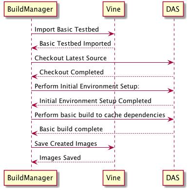

# BBN IMMoRTALS Build System

## Local Testbed Usage

shared/tools.sh includes a 'buildsystem' argument that provides access to this functionality

### Requirements
 - Python 3.5  
 - Python modules 'websockets', 'sanic', and 'requests'. These can be installed with the following command:  
   `pip3 install websockets==6.0 sanic==0.7.0 requests==2.18.4`
 - BBN Internal network access
 - An ssh key located at `~/.ssh/immortals_vine_id_rsa` on your local machine that is authorized to access the Vine 
 IMMoRTALS testbeds. See Austin for a pre-generated one.
 
### Remote Access

The `--create-testbed-autoconf` and `--jenkins-autoconf` commands support painless access to deployed test systems. 
They do this by generating corresponding ssh configurations at the following location: 
`~/.ssh/immortals_vine_<lowercase testbed name>_config`. Your existing keys and `~/.ssh/config` file are not 
touched. In order to use these configurations, you must add the following line to your `~/.ssh/config` with the proper 
file name to include the configuration:

`Include immortals_vine_<lowercase testbed name>_config`

### Jenkins Failure Debugging Steps

1.  Navigate to the Jenkins dashboard that contains the failed test.
2.  On the build you wish to debug, click any of the steps other than the first one. Then tap logs to see some details.
3.  At the top of the window you will see a shell script execution that begins with something similar to the following:
    `shared/tools.sh buildsystem autobuild_cp1_89`
4.  This simply says "From tools script, use the buildsystem section with the required testbed name 'autobuild_cp1_89'" 
    The testbed name is the key piece of information you need to gain access to the machine.
5.  With this information, from the root of a local immortals repo, execute the following command, replacing 
    'autobuild_cp1_89' with your testbed name:
    `./shared/tools.sh buildsystem autobuild_cp1_89 --jenkins-autoconf`
6.  Follow the instructions to access the DAS and Android Emulators if applicable.

HINT: The jenkins-autoconf configuration always clobbers the same file (`~/.ssh/immortals_vine_jenkinstemp_config`) 
so after running the above command you just need to ssh into the machine.

### Remote Testbed Setup

The `--create-testbed-autoconf` command is recommended as it does most of the grunt work with setting up ssh.

Key details:
 - The user's name is automatically prepended to the testbed name internally to minimize naming conflicts between users.
 - The autoconf variant of the create testbed command creates a `~/.ssh/immortals_vine_<lowercase testbed name>_config` 
   file that contains ssh profiles that can be sourced from `~/.ssh/config`. The command will provide additional 
   details after completion regarding this and how to access the testbed DAS and emulators.

## Vine Image Details

### Image Types

Images have a timestamp appended to their name during automated creation. When creating a new testbed this will be 
scanned and the latest image will always be used. The resultant name is in the following format:  
  
`  <Identifier> [%Y-%m-%d %H:%M:%S]'`

#### Base Image Type
A _Base_ image contains nothing other than ssh credentials and basic machine configurations such as networking 
interfaces and is meant to reflect the clean slate that will be used for evaluation. It may be updated from time to 
time but care must be taken to always reflect the evaluation environment as closely as possible.

#### Pre-Deploy Image Type

A _Pre-Deploy_ image is derived from the _Base_ image and is used to provide fast test execution without needing to set 
up the system and fetch dependencies every time testing is required. It executes the environment configuration script 
and executes some additional build tasks to significantly speed up the build and execution process such as filling 
the dependency cache and executing the initial stack project setup commands. It is created using the following sequence:

### Execution Testbed

The execution testbed consists of three machines: _DAS_, _Android 21 Emulator 00_, ,and _Android 21 Emulator 01_. 

#### DAS
The DAS machine is the only one that utilizes the _Pre-Deploy Image Type_. It has the following characteristics:  
  * 8-Core, 16 GB Memory, 160 GB Storage
  * Base Image Name: 'IMMoRTALS DAS Base \[%Y-%m-%d %H:%M:%S\]'  
    - Example: 'IMMoRTALS DAS Base \[2018-09-05 12:20:45\]'
  * Pre-Deploy Image Name: 'IMMoRTALS DAS Pre-Deploy \[%Y-%m-%d %H:%M:%S\]'  
    - Example:'IMMoRTALS DAS Pre-Deploy \[2018-09-05 15:22:15\]'
  * External IP: Automatically assigned at machine creation
  * The file `~/immortals_override_file.json` is created as part of deployment and contains information such as the 
    external IP address and android emulator IP addresses.

#### Android 21 Emulator 00
The Android emulators only utilize a _Base_ image since no time-consuming preparation is necessary. It has the 
following characteristics:
  * 4-core, 4GB Memory, 20 GB Storage
  * Base Image Name: 'Android 21 Emulator Base \[%Y-%m-%d %H:%M:%S\]'  
    - Example: 'Android 21 Emulator Base \[2018-09-05 12:20:45\]'
  * External IP: Automatically assigned at machine creation
    - You can connect adb to the emulator running on this machine by executing  
      `adb connect <EXTERNAL_IP>:5432`

#### Android Emulator 01
Same as _Android 21 Emulator 00.

## Jenkins Environment Construction

WIP/SCRIBBLES/NOT WORKING!

Jenkins machine
1. Create an Ubuntu VM with 4GB memory and 4 CPUs on Vine.
2. Copy base_vm_setup.sh to the VM.
3. Execute the base_vm_setup, specifying "jenkins" as the deployment parameter.
4. Follow the additional instructions it indicates.

TODO: Add vine immortals coordinator details

1. Go to shared/buildsystem/jenkins_scripts
2. For each file, add a new "Pipeline" task.
3. In the "Pipeline" section, add a "Pipeline Script from SCM where the SCM is "Subversion" with the following Repository URL, using the buildbot credentials to get access:  
   svn+ssh://dsl-external.bbn.com/svn/immortals/trunk
4. Add the script path.

Note: No actual building is done on the jenkins machine. The local repository is simply to obtain the scripts to be used to interact with the vine cluster.
